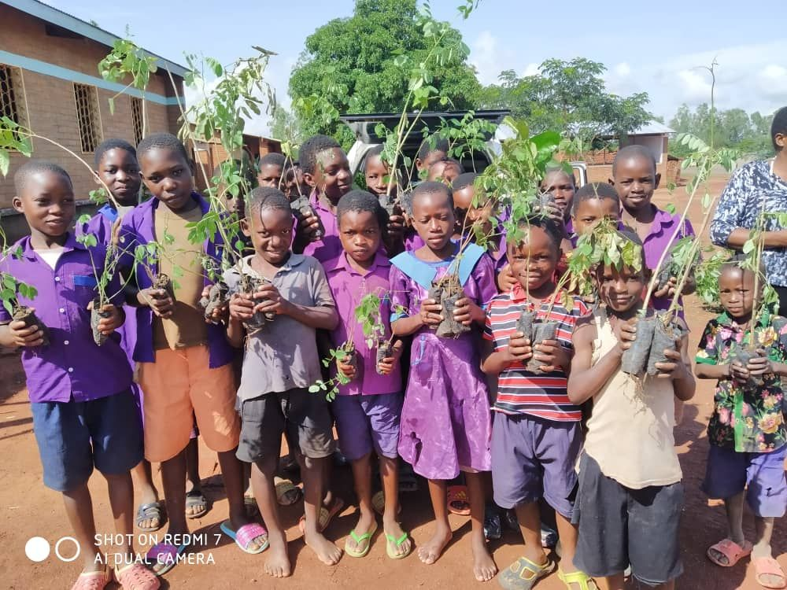
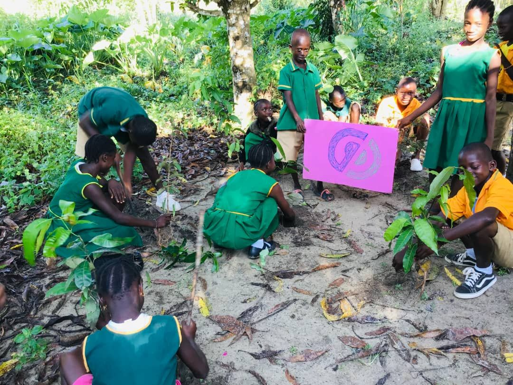

*‘Being sustainable’ has become a buzzword – a claim to boost our image rather than an honest endeavour. It is hard to trust people and brands today when we fear to fall into the trap of greenwashing again. However, we have no choice but to change our behaviour and consumption if we want to combat climate change and the collapse of biodiversity.*

 

Last November, [COP26](https://www.nature.com/articles/d41586-021-03431-4) shed light on how indecisive and inactive our global institutions and governments still are in the face of an unprecedented climate crisis. We have to come to terms with the fact that carbon-neutral and sustainable operations won’t be enough anymore. The  rising global carbon emissions have been linked to the increasing amount of heat waves, droughts, floods and hurricanes recorded globally, we must rethink everything if we are to s

 

Once emitted, carbon dioxide can persist in the atmosphere for several hundreds, possibly thousands, of years. Now’s the time for regenerative action. We must actively reverse the environmental harms of the past and stop biodiversity loss.

## How not to destroy our planet

*“The greatest threat to our planet is the belief that someone else will save it.” – Robert Swan*

 

By taking action and making the right choices for our planet and humanity, we can not only reduce but even remove carbon emissions, prevent the truly [severe levels of global warming](https://www.technologyreview.com/2021/12/23/1042973/climate-change-action-progress-clean-energy/) and restore the health of our planet. To restore the health of our planet and prevent even more irreversible damage, massive amounts of carbon emissions have to be offset – and soon. 

 

Starting with the reduction of emissions to the lowest level possible, we’ll also need to compensate for all remaining as well as past emissions. As technological solutions for removing carbon emissions are not only very expensive but also still in an experimental stage, nature-based solutions are the way forward.

 

Did you know that warnings about the risks and harms of excessive carbon emissions date back as far as the 1960s to [a report](https://www.climatefiles.com/climate-change-evidence/presidents-report-atmospher-carbon-dioxide/) by former US President Johnson’s Science Advisory Committee? We’ve clearly been inactive and ignorant for much too long. There’s always another crisis, another challenge to tackle. But we can’t afford to ignore climate change and biodiversity loss any longer.

 

 

If anything, current crises like the Covid-19 pandemic and the war in Ukraine teach us that we are capable of taking bold actions, we are able to pivot – if we take the matter seriously enough. During the global pandemic, drastic measures were taken to ensure people’s health and safety, including severe travel bans. Something that previously would have been deemed unthinkable. The war in Ukraine sparked a range of sanctions against Russia, and Europe is now looking to reduce its dependency on Russian energy by [cutting two-thirds](https://fortune.com/2022/04/25/germany-trying-to-transition-away-from-russian-fuel-and-hackers-are-now-hitting-german-wind-energy-companies/) of its Russian gas imports within a year.

 

Quite significant measures, right? Clearly, individuals, organizations and even governments are capable of pivoting in times of crises. Why is it that we don’t recognize the climate crisis for what it is?

 

We need to tackle the climate crisis and biodiversity collapse with the same urgency, force and determination like we do with other crises. And we finally need to face the reality and severity of the climate crisis now! After all, Greta Thunberg is right: “Nature does not bargain and you cannot compromise with the laws of physics.”

 

So, what are we doing at ThreeFold? How are we contributing to restoring the health of our planet? How are we taking climate action?

## Our commitment

*ThreeFold and Take Action Global (TAG) are on a mission to regenerate the planet together. By offsetting the ThreeFold Grid’s carbon emissions three times in the form of Voluntary Carbon Credits, both ecosystems are joining forces to provide planet-positive Internet and to realize climate education and economic inclusion programs.*

 

We believe our planet needs regenerative solutions at a large scale. While the [ThreeFold Grid](https://library.threefold.me/info/threefold#/tfgrid/threefold__tfgrid_home) is already much more [energy efficient](https://threefold.io/blog/post/for_our_planet/) than the traditional Internet, some energy will always be left. There will always be emissions that have to be compensated for. We’re not going for the carbon neutrality of the ThreeFold Grid but for carbon negativity, i.e. offsetting its emissions three times through planting and protecting trees.

 

And we decided to empower our community to take part in our regeneration efforts in a low-threshold way. ThreeFold Farmers will automatically offset their carbon footprint three times, and everybody will be able to use the ThreeFold Grid’s regenerative Internet capacity while simultaneously making positive impacts for the planet and the people.

 

As we shared in our Planet-Positive Farming Series, we’re setting the plan for a planet-positive Internet by implementing a [Voluntary Carbon Credits](https://forum.threefold.io/t/threefold-on-track-to-be-planet-positive/2097?u=hannahcordes) (VCC) system and supporting [planet-positive initiatives](https://forum.threefold.io/t/supporting-initiatives-to-regenerate-the-planet/2110?u=hannahcordes) with our trusted partners from [Take Action Global](https://forum.threefold.io/t/driving-regeneration-with-tag/2120?u=hannahcordes) (TAG). 

## Driving regeneration with Take Action Global

In December 2021, we [announced](https://www.prnewswire.com/news-releases/threefold-and-take-action-global-partner-to-bring-internet-access-to-1-billion-people-across-the-globe-301446693.html) our commitment to achieve a [carbon double win](https://forum.threefold.io/c/ecosystem-developments/sustainability/90) for the ThreeFold Grid. We’re aiming to realize the initial promise of the Internet while also regenerating the planet. By starting from scratch at the operating system level, we were able to build an Internet infrastructure that is highly [energy efficient](https://threefold.io/blog/post/internet_energy_consumption/) – we’re using about 10 times less energy than any comparable alternative.

 

Together with [TAG](https://threefold.io/partners/take_action_global/) – experts on climate action and education who were recently [acknowledged](https://twitter.com/threefold_io/status/1493980240275812352?s=20&t=uW8aclYr82-xqQkEsCeGWw) for their incredible work by the Anthem Awards – we kicked off a pilot program for tree planting. After measuring the carbon footprint of the Grid and individual [3Nodes](https://threefold.io/farm), we knew what it would take to go beyond climate neutrality and fulfill our planet-positive commitment. By launching tree planting initiatives in Sierra Leone, Malawi and Cambodia, we’re on our way to compensating the Grid’s yearly emissions three times. This way, we’ll plant enough trees in 2022 to lay the foundation for achieving and sustaining a carbon double win for our Internet infrastructure. Already, students and teachers in the three countries have planted more than 5,300 trees. Find out more about the pilot program [here](https://forum.threefold.io/t/driving-regeneration-with-tag/2120?u=hannahcordes) and head to the [EarthProject](https://earthproject.org/treeplanting) page for the tree-planting details and how you yourself can get involved.

 

 

 

Once we laid the foundation for offsetting the ThreeFold Grid three times, we will continue to produce Voluntary Carbon Credits to finance further initiatives, such as fostering climate education and renewable energy grid developments to enhance the life of communities at large.

## A regenerative Internet for the planet and the people

A holistic solution to the [inefficiencies](https://threefold.io/blog/post/internet_energy_consumption/) and emissions of today’s Internet architecture is needed. We all need to take responsibility and to pull our own weight. But we’re in this together. And together, this will happen.

 

By pioneering the creation of an energy-efficient and regenerative Internet for all of humanity, the ThreeFold ecosystem consists of like-minded people and partners that share our values and support us in realizing the original promise of the Internet. United in our shared beliefs in open source, peer-to-peer, equality and inclusion, we come together to build a holistic solution for the many issues associated with today’s Internet – from inefficiencies and emissions to centralization and limited accessibility. And we’re being acknowledged for our collective work – we’re [nominated](https://evenements.optionfinance.fr/les-debats-finance-impact-rse/content/candidats-sia) for the Sustainable Investment in Action [Awards](https://sustainableinvestmentinaction.com/awards-conferences-2022/) in the category “Basic Needs”.

 

Together, we’re making it easy for everyone to join us in regenerating our planet – all you have to do is connect a [3Node](https://threefold.io/farm) to the ThreeFold Grid and you’ll effortlessly regenerate the earth by providing Internet capacity – a process we call ‘farming’ because it’s a greener, purposeful [alternative](https://threefold.io/blog/post/farming_a_greener_alternative_to_crypto_mining/) to crypto mining. After kicking off our [pilot program](https://forum.threefold.io/t/driving-regeneration-with-tag/2120?u=hannahcordes) a month ahead of schedule, we’re well set to achieve the carbon double win for the ThreeFold Grid in 2022, driving the regeneration of our planet.

 

Join our global [community](https://t.me/threefold) of independent farmers today!

 

And don’t forget:

 

*"What we do today will determine what the world looks like tomorrow." – Marie von Ebner-Eschenbach*

 

P.S.: We’ll keep you posted on our progress in the [Carbon Double Win](https://forum.threefold.io/c/ecosystem-developments/sustainability/90) section of our forum. If you have any ideas for further planet-positive initiatives or potential partnerships, let us know there.
