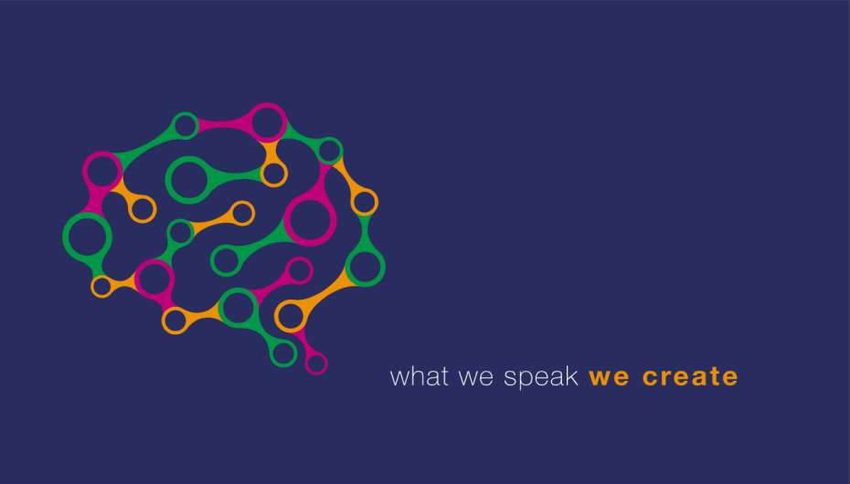

# Collective Intelligence Collaboratory

 

 

## About

At *Collective Intelligence Collaboratory - CICOLAB*, we know that by combining the right mix of diverse voices, simple tools, and methods that really work – such as better profiling methods, mapping, collaborative editing, peer learning, and Rapid Sensemaking – we can create the conditions where paradigm-shifters in multiple fields can better collaborate. In these ways we can better find each other, communicate more easily about what we are working on, and learn about tools and techniques to co-create, co-work and co-produce more effectively.

 

<iframe src="https://player.vimeo.com/video/436772110" width="800" height="450" frameborder="0" allow="autoplay; fullscreen" allowfullscreen></iframe>

 

### The Problem

Arguably, our planet depends upon humans figuring out how to get together and make good decisions together. But we don’t yet have the social frameworks or technology to effectively collaborate – we don’t flow as we grow – and we may be “running out of time” much more quickly than most of us realize.
Generally when we try collaborating between more than three people, we struggle to overcome many barriers. These include using various messaging or collaboration tools (Facebook, Telegram, Instagram, etc.) which – by design – do not interoperate. 
New social operating systems have little insight or grounding in decentralized collective decision-making without top-down power structures. Even when people do manage to raise collaborative processes off the ground, projects often crash in flames.

### The Solution

CICOLAB brings together thought leaders and experts from diverse areas of collective intelligence to figure out how we might work, build and learn together, better and faster. 
We host and moderate online events for people with projects, initiatives and organizations which may overlap in surprising and synergistic ways. Through conversation we can meet each other and form deeper relationships.

Here are some examples of our colleagues’ activities:

 

- Marc-Antoine is a programmer and specialist in interoperable data structures;
- Jillian is a facilitator guiding collaborative groups experiencing emotional difficulties;
- Christina is designing software to map social relationships decentrally within a network;
- Sean is developing a framework for measuring business impact beyond financial profits.

 

While everyone is working on very different projects, we are all striving to create better conditions for decision-making, knowledge sharing, and highlighting flows of valuable information which may be invisible. CICOLAB cultivates an extensive “knowledge garden” i.e. database of interviews and roundtable discussions, plus maps and other visuals showing (a) various core aspects of collective intelligence, (b) who is working on what, and (c) their actual or possible relationships.

### The Process:

We design easy ways to generate “Deep Profiles,” videos and short texts that capture an individual’s role within a group plus the group’s role within a network. Then it’s much easier to know who is doing what and who has which talents or interests. The Deep Profile lets one’s reputation emerge naturally without creating a top-heavy or dystopian “reputation system.”

 

CICOLAB is at the crossroads of many different networks. Our prolific network weaving is driven by purpose, creativity and fun. Increasingly we include groups of many cultures speaking many languages.
We host discussions and process them thoroughly (generating transcripts, summary notes, and graphic art) to leave behind “knowledge trails” for anyone to follow.

 

## Mission

CICOLAB brings together visionaries from diverse fields to develop simple, practical ways to amplify network intelligence.

 

## Impact

We create, collect and apply effective, accessible tools and methods to make groups smarter. Our approach is to allow the communication of projects, ideas and people to be easier and better so network members can find, align and collaborate with each other. 

 

## Powered by ThreeFold

We can help people, projects and companies “Powered by ThreeFold” to find their “soul mates” (i.e. ideal partners) around the world by developing a dynamic, scalable onboarding system that helps network members find their place in the ecosystem and better convey their needs and offers.

 
We’re also developing innovative gaming methods to assess risk and minimize mis- or disinformation (aka “Crap Detection”). Thus the ThreeFold network can remain safe, healthy and vibrant, and protect itself from toxic patterns of abuse that have destroyed other coalitions.

<!-- ## Join saving our planet!

We invite you to [join the conversation](https://www.collectiveintelligencecollaboratory.com/the-collaboratory), explore our [knowledge repository](https://workflowy.com/s/collective-intellige/j4VFPGtdeKapOPmH), get involved in and support our [Rapid Learning Network](https://docs.google.com/presentation/d/1fJyb323YcNEdXBlhbMd5OtLd4zRhXJsd-dGkCysXGBs/edit#slide=id.g6cb7bf93bd_0_19).

## TFGrid Solution

### Roadmap -->

